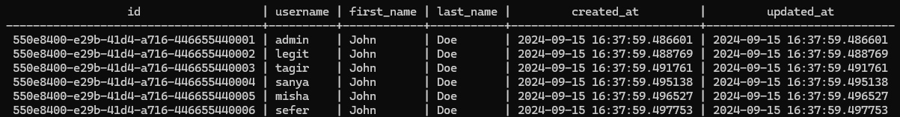
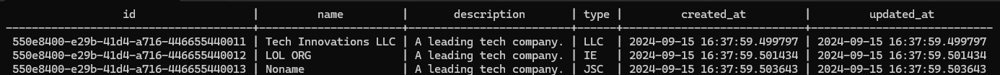
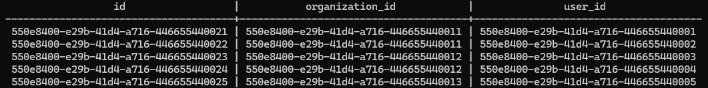

## Запуск проекта с использованием Docker

Чтобы запустить проект с помощью Docker, выполните команду:

```bash
docker-compose up --build
```

После сборки проект будет доступен по адресу `localhost:8080`.

### Важная информация для пользователей Windows

Если вы работаете на Windows, возможно, у вас возникнут проблемы с выполнением скриптов из-за различий в стилях окончания строк между Windows (CRLF) и Linux (LF). Docker требует, чтобы файлы были в LF-формате. Это особенно важно для следующих файлов:

- `docker/start.sh`
- `docker/wait-for-it.sh`
- `docker-compose.yml`
- `Dockerfile`

Убедитесь, что указанные файлы имеют стиль строк LF. Вы можете конвертировать файлы из CRLF в LF с помощью любой текстовой редакции, например:

#### Visual Studio Code

1. Откройте файл в VS Code.
2. Нажмите на индикатор стиля окончания строк в правом нижнем углу.
3. Выберите "LF" (или "Convert to LF").

# Проверка сервиса на тестовых данных

Это шаги для проверки вашего сервиса на тестовых данных в контейнере PostgreSQL. 

## Подготовка тестовых данных

0. **Для начала перейдите в командной строке в папку с проектом**

   ```sh
   cd путь/к/папке/с/проектом
 
2. **Скопируйте SQL-файл с тестовыми данными в контейнер**

   Выполните команду ниже для копирования SQL-файла `test.sql`, который содержит тестовые данные, в контейнер PostgreSQL. Это позволяет выполнить тестовые команды внутри контейнера.

   ```sh
   docker cp ./test.sql db_app:/test.sql

3. **Выполните SQL-файл внутри контейнера**

   Выполните команду ниже для запуска SQL-файла в контейнере PostgreSQL. Это добавит тестовые данные в базу данных.

   ```sh
   docker exec -it db_app psql -U postgres -d postgres -f /test.sql

## Проверка данных

1. **Просмотрите данные в таблице employee**

   Эта команда извлекает все данные из таблицы employee. Используйте её для проверки, что сотрудники были добавлены в базу данных.

   ```sh
   docker exec -it db_app psql -U postgres -d postgres -c "SELECT * FROM employee;"



2. **Просмотрите данные в таблице organization**

   Эта команда извлекает все данные из таблицы employee. Используйте её для проверки, что сотрудники были добавлены в базу данных.

   ```sh
   docker exec -it db_app psql -U postgres -d postgres -c "SELECT * FROM organization;"



3. **Просмотрите данные в таблице organization_responsible**

   Эта команда извлекает все данные из таблицы employee. Используйте её для проверки, что сотрудники были добавлены в базу данных.

   ```sh
   docker exec -it db_app psql -U postgres -d postgres -c "SELECT * FROM organization_responsible;"



### Дополнительная информация

Если у вас возникают проблемы при запуске проекта, убедитесь, что все скрипты и конфигурационные файлы используют правильный стиль строк.
